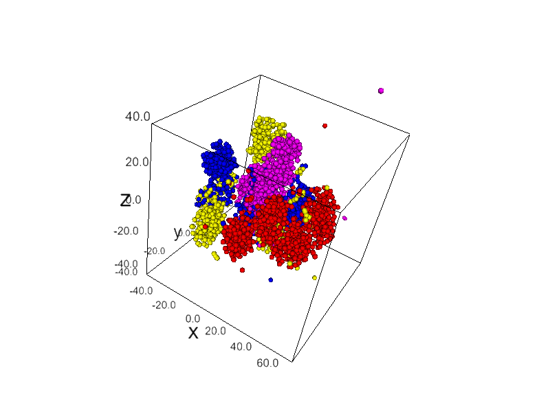

[](https://mybinder.org/v2/gh/MohammadJavadD/TSNE_EEG.git/master)

# Apply T-sne ([TSNE](https://scikit-learn.org/stable/modules/generated/sklearn.manifold.TSNE.html)) on EED data


First, Install requirments:

```
  pip install -r requirements.txt
```
Run it online:
https://mybinder.org/v2/gh/MohammadJavadD/TSNE_EEG.git/master




